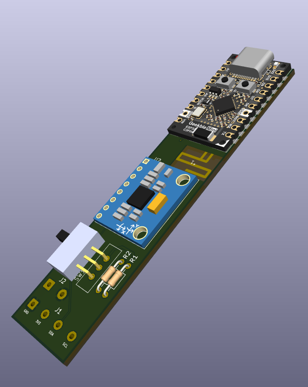
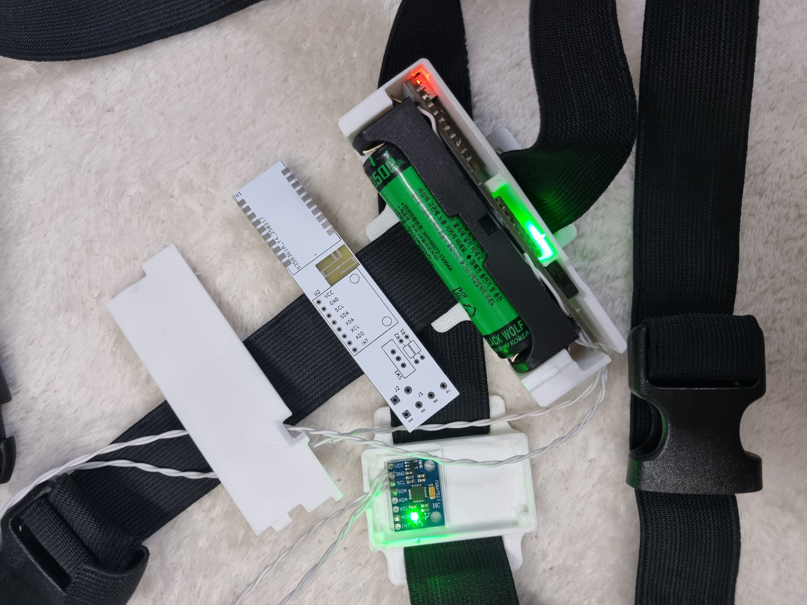

 
# hotdoggu_slimeVR_PCB
KiCad project - slimevr tracker using Geekble mini ESP32C3, MPU6050    
Includes PCB Antenna (Meandered PIFA 2.4Ghz)    
&nbsp;&nbsp;&nbsp;&nbsp;&nbsp;***Solder 1st pin(left side pin of ant. from top view) to Geekble mini's Ant feed(right side pad from top view)***    
Includes 3d-printable case **(for 18650 cell and socket, needs glue like hot melt for assembly)**
# Used Components
|Component|Description|Link|
|---------|-----------|----|
|Geekble Mini ESP32C3|ESP32C3 module|https://www.devicemart.co.kr/goods/view?no=15483281|
|GY-521|MPU6050 module|https://www.devicemart.co.kr/goods/view?no=1247052|
|MSL-1C2P|Power Switch|https://www.devicemart.co.kr/goods/view?no=38883|
|100k axial resistor|2ea. For battery voltage measurement|-|
|18650 Li-ion cell|1ea. use any 18650 cell or Li-ion battery. Solder to J2.    Note:    the 3d model in STL files is made for 18650 cell. **This PCB does NOT has charging circuit!**|-|
|BB521|18650 battery socket|https://www.devicemart.co.kr/goods/view?no=12766763|
# slimeVR Configuration
**platformio.ini**
```ini
[env:esp32c3]
platform = espressif32 @ 6.7.0
platform_packages =
 framework-arduinoespressif32 @ https://github.com/espressif/arduino-esp32.git#3.0.1
 framework-arduinoespressif32-libs @ https://github.com/espressif/arduino-esp32/releases/download/3.0.1/esp32-arduino-libs-3.0.1.zip
build_flags =
 ${env.build_flags}
 -DESP32C3
board = lolin_c3_mini
```
    
**defines.h**
```C
#define IMU IMU_MPU6050
#define SECOND_IMU IMU_MPU6050
#define BOARD BOARD_CUSTOM
#define IMU_ROTATION DEG_270
#define SECOND_IMU_ROTATION DEG_180
#define PRIMARY_IMU_OPTIONAL false
#define SECONDARY_IMU_OPTIONAL true
#define MAX_IMU_COUNT 2
#ifndef IMU_DESC_LIST
#define IMU_DESC_LIST \
    IMU_DESC_ENTRY(IMU,        PRIMARY_IMU_ADDRESS_ONE,   IMU_ROTATION,        PIN_IMU_SCL, PIN_IMU_SDA, PRIMARY_IMU_OPTIONAL, PIN_IMU_INT) \
    IMU_DESC_ENTRY(SECOND_IMU, SECONDARY_IMU_ADDRESS_TWO, SECOND_IMU_ROTATION, PIN_IMU_SCL, PIN_IMU_SDA, SECONDARY_IMU_OPTIONAL, PIN_IMU_INT_2)
#endif
#define BATTERY_MONITOR BAT_EXTERNAL
#elif BOARD == BOARD_CUSTOM
#define LED_PIN 10
#define LED_INVERTED false
#define PIN_IMU_SDA 4
#define PIN_IMU_SCL 5
#define PIN_IMU_INT 255
#define PIN_IMU_INT_2 255
#define PIN_BATTERY_LEVEL 0
#define BATTERY_SHIELD_RESISTANCE 0
#define BATTERY_SHIELD_R1 100
#define BATTERY_SHIELD_R2 100
```

# Thanks to
usini:usini_kicad_sensors    
https://github.com/usini/usini_kicad_sensors